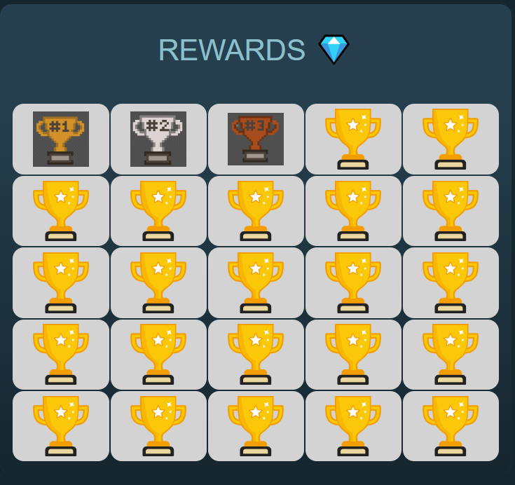
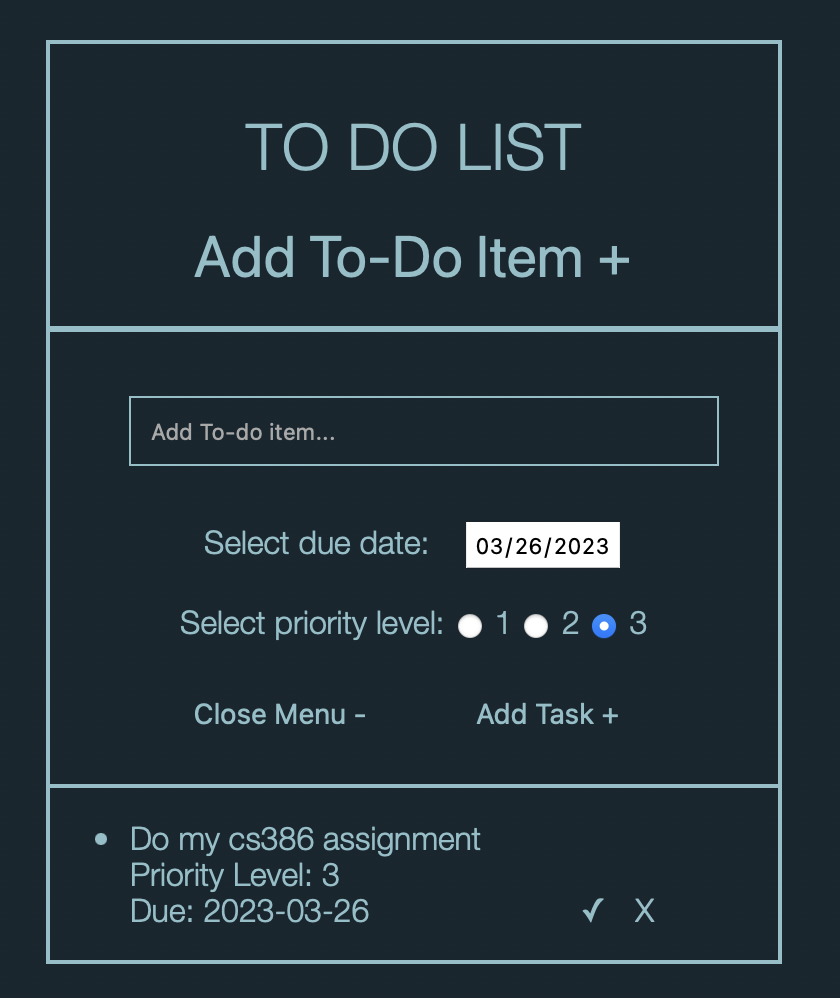
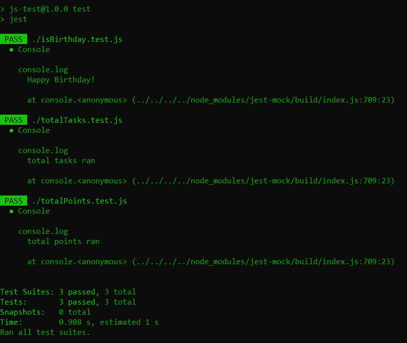

# Deliverable 4 - First Implementation

## 1. Introduction
SideQuests is an easy to use website that assists in navigating the chaos of life with reminders and rewards, praising you for staying on track. The main features of this product are being able to track your progress and get rewarded for completing tasks. Users have the option of listing tasks and the date that they need to be completed by. Users can also collaborate with their friends on tasks, and see their friends status's. As of right now, the features implemented are as follows. There is a calendar on the webpage that shows the current month and highlights the current day. There is a to-do list that users can add tasks to. They can also delete the tasks off of the list. There are pages for the friends list, and the trophies that have been earned, although there is currently no database to hold the information. There is also an initial login page, but again without the database it is currently nonfunctional.

https://github.com/cs386-03/SideQuests

## 2. Implemented Requirments

**Requirement:** _As a student, I want to be able to log in on multiple devices so I can see my to-do list and calendar from anywhere._ \
**Issue:** [Issue #91](https://github.com/cs386-03/SideQuests/issues/91)\
**Pull Request:** [Pull #86](https://github.com/cs386-03/SideQuests/pull/86)\
**Implemented by:** Lauren Farr\
**Approved By:** Joshua VanderMeer\
**Print screen:** \

**Requirement:** _As a website user, I want to be able to see the rewards I have earned so I know what I have completed_\
**Issue:** [Issue #45](https://github.com/cs386-03/SideQuests/issues/45) \
**Pull Request:** [Pull #93](https://github.com/cs386-03/SideQuests/pull/93)\
**Implemented by:** Caden Tedeschi\
**Approved By:** Lauren Farr\
**Print screen:**\

**Requirement:** _As a website user, I want to be able to message my friends so that I can get encouraged sharing progress._\
**Issue:** [Issue #50](https://github.com/cs386-03/SideQuests/issues/50)\
**Pull Request:** [Pull #89](https://github.com/cs386-03/SideQuests/pull/89)\
**Implemented by:** Meaghan Freund\
**Approved By:** Joshua VanderMeer\
**Print screen:**

**Requirement:** _As a student, I want to be able to show my friends my rewards so that I can show them my progress and we can encourage each other to succeed._ \
**Issue:** [Issue #104](https://github.com/cs386-03/SideQuests/issues/104)\
**Pull Request:** [Pull #86](https://github.com/cs386-03/SideQuests/pull/86)\
**Implemented by:** Joshua VanderMeer\
**Approved By:** Caden Tedeschi\
**Print screen:** \

**Requirement:** _As a student, I want to be able to create my own tasks to add to my list, so that I can personalize the tasks to my own needs._ \
**Issue:** [Issue #42](https://github.com/cs386-03/SideQuests/issues/42)\
**Pull Request:** [Pull #97](https://github.com/cs386-03/SideQuests/pull/97)\
**Implemented by:** Max Poole\
**Approved By:** Lauren Farr\
**Print screen:** \

**Requirement:** _As a website user, I want to be able to have a calendar and tasks on one page so that I can save time._\
**Issue:** [Issue #40](https://github.com/cs386-03/SideQuests/issues/40)\
**Pull Request:** [Pull #83](https://github.com/cs386-03/SideQuests/pull/83)\
**Implemented by:** Samantha Madderom\
**Approved By:** Joshua VanderMeer\
**Print screen:** \

## 3. Tests
**Test Framework:** For our automated tests, we used the framework Jest, which can be accessed [here](https://jestjs.io/docs/getting-started). \
**Tests Folder:** The folder containing the tests can be accessed [here](https://github.com/cs386-03/SideQuests/tree/main/Tests). \
**Example:** One thing we tested is a function that adds to the user's total accumulated points, given their existing total and recently accumulated points. The function adds the points and returns the total, and changes the inner text of the HTML to reflect the change in points. The test of this function ensures that the correct number is returned, and the correct text is displayed for the user. \
**Print screen:** \

## 4. Adopted Technologies
**Visual Studio Code:**

As a group, we decided to use the same code editor, in which Visual Studio Code is a code editor that allows for building and debugging code. We decided that VSCode would be the best for building our code as we can test pages for the website with ease. In addtion, using the same code editor ensures cohesion while we create code individually.

**JS 2 Calendar:**

The goal of SideQuests is to provide a fun and free planner that keeps students organized with college life, meaning that a calendar is needed to be implemented. As the group is using JavaScript, the best decision for the current version of the website is to use a JavaScript implementation of a calendar. The calendar shows accurate months and days for the current year, as well as having a button to display the current date.

**Hostwinds:**

The format of SideQuests is a website, in which needs a server to be accessible by anyone utilizing it. The group decided on using Hostwinds as it is a web hosting service that we are all familiar with. Hostwinds only relies on itself instead of a third party to provide the server we need, which makes it a simple website host for SideQuests.

**Piksel:**

SideQuests utilizes a rewards system to encourage users to stay on track and earn more points. To better visualize this, sprites for each reward are being made as trophies. Piksel is a free online sprite editor that is very useful to make images for each reward with complete creative freedom.

**Summary:**

SideQuests is a functional demo currently, with a working to do list and functioning calendar, and is accessible to the public. Although a lot of the key functions of the website are yet to be finished, SideQuests is on the right track with the basics of the website implemented and the group has a better insight of what the website will become.

## 5. Learning/Training

The group decided on first splitting up the group in six sections to cover the most ground in terms of implementation, including the research. For our first version of the website, there was not a whole lot of research needed, but the points that were needed serve as key roles of the website. The most important part of the current version of SideQuests that needed to be researched was the calendar. Some suggestions were thrown out in case a calendar could not be implemented, such as creating our own calendar, however it would not work in the long term. Luckily, JavaScript has its own calendar implementation, which works well with how we are implementing the website itself. Despite this, the JavaScript calendar does not have a day-by-day view that allows users to see when tasks are due at specific times. The group settled on implementing the JavaScript calendar for the first version and to add a more complicated one later down the road.

Another part that needed to be researched was the log in page, which needs to safe information on the username and password and remember any information from the client's information. However, the most applicable option for our website is being shut down in the current month, pushing back the availability of the log in page. Despite this, some other options that may be looked into include GitHub and Facebook login software, which will be a bit lower as a prioriy as more research will be conducted on adding tasks and events in the calendar of SideQuests.

As our project continues, there will likely be more research, such as on a more proper calendar implementation with timestamps, login software, and connecting with other friends with accounts and being able to share information stored within profiles.

## 6. Deployment
[http://sidequests.pro/](http://sidequests.pro/) This is the URL and website to which our product is being deployed to. We are also using host winds to host the webserver to run this website.  To visit just head to this link currently if you press login it will take you past the login page to our homepage. From Here you can look at your to-do list and calendar and also redirect to your profile or friends list.

## 7. Licensing

We decided to use the MIT license for our project. The MIT license is a free copyright license that allows for people to collaborate and contribute to the project without over complicating things. This license allows for open source collaboration.\

Here is a link to our MIT license:\
[MIT license](https://github.com/cs386-03/SideQuests/blob/main/LICENSE.md)

## 8. Readme File

The readme file has links to both the Contributing and Code of Conduct files \
[README](../README.md)

## 9. Look and Feel

We wanted our site to have a dark mode theme and be similar in aesthetic to the Github or Discord's dark mode. Our background colors include dark gray, navy blue, and black, while the text and highlights are in white and light blue. The dark color scheme helps the awards stand out. For the awards - and eventually for our main logo - we decided to go with a 16-bit, pixelated art style. This art and the name of the software are reminiscent of older videogames. These style choices give the idea that checking things off your to-do list is like a game, encouraging productivity and completion of important real-life tasks.

## 10. Lessons Learned
In this first implementation we as a group have learned some valuable lessons one of the big ones being that even with GitHub communication is critical to prevent overlaps and other development issues. This happened a few times with people changing files to fit what they were developing and this caused a massive overlap and bottleneck of changes. So going forward we will increase communication. We also learned that it's okay to work in groups and ask question if you get stuck because it helps keep things moving. Overall, we are doing well as a group just some minor fixes to be made with communication and we will be on our way.

## 11. Demo
A demo of the system running can be found [here](https://github.com/cs386-03/SideQuests/tree/main/Demos/Demo_1.mp4).
