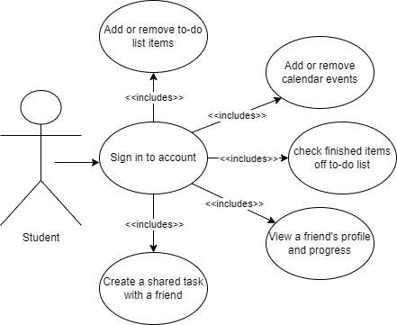
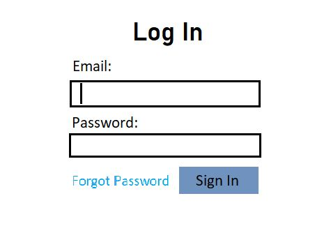
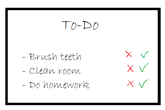

# Deliverable 2 - Project Requirements

## 1. Positioning
### 1.1: Problem Statement
The problem of disorganization and cluttered schedules affects college students and professors alike; the impact of which is a stressful existence and forgetting to complete important tasks throughout any given day.

### 1.2: Product Position Statement
For people working or studying at a college who have busy schedules, SideQuests is a calender/planner website that turns organization and productivity into a rewarding activity; unlike Google Calender our product offers a rewards system to encourage the user to complete their tasks every day.

### 1.3: Value proposition
SideQuests is an easy to use website that assists in navigating the chaos of life with reminders and rewards, praising you for staying on track.

## 2. Stakeholders
**Users/Testers - NAU students**

NAU students and users that test our software will provide input on what the project is missing and how it may be improved. It is best to get a third-party view of what is missing from the website being developed for better insight on what is desired from the product. 

**Competitors - Online Planners (Google Calendar)**

Online planners are not an uncommon thing, especially to college students as our audience. We will present our product as something different than our competitors, such as Google Calendar, as we offer more incentive to finish the user’s tasks.

**Application Developers - Project Team**

As the developers, we are constantly changing and improving our product and are able to test it and run through what specifications are missing or lacking in the project. 

**Community - NAU**

Having an effective planner will aid in having school work turned in on time, or even earlier, which helps professors, in our case NAU faculty, in keeping students on track and ready for class. This could also apply to jobs outside of regular school work, for example NAU offers work for the school, such as tutoring or grading for a class, which would be more effective with employees getting grades in a timely manner or being prepared for tutoring sessions.

## 3. Functional Requirements (Features)
- Users will be able to see their progress on tasks.
- Users will be able to see all achievements.
- Users will have the option to pick tasks for the day.
- Users will be able to see total XP.
- Users will have a choice of categories for tasks.
- Users will receive prizes based on accomplishments.
- Users can have challenges between users.
- Users will be able to interact and see friends' status of tasks.
- Users will be able to add their own tasks to a to-do list.
- Users will be able to add events to the calendar.

## 4. Non-Functional Requirements
1. Usability - Users will be able to navigate with clear labels and no help from developers.
2. Speed - The website will be fast enough to keep up with daily task completion and trophy/award gains.
3. Reliabilty - The website utilizes a trusted server so users can access the site at anytime.
4. Compatibility - The website works and displays properly across mobile phone, tablet, laptop, and desktop computers.
5. Readability - Users will be satisfied with how the website looks and how easy it is to take in information.
6. Resource Constrained - Webpages for the site will be less than 6mb.
7. Accessibility - Colorblind friendly and having alt text for all images. 
8. User Interface Aestehetics - Have every aspect of the webpage design look pleasing and work together to form an enjoyable experience on the website.

## 5. MVP
A Minimal Viable Product for this project would include a calendar on an accessable webpage with a few tasks that users are able to assign for themselves for a specific day. These will be tasks that they can either choose from a bank, or give their own description for. Completing these tasks will earn them awards that they are able to see and collect. This will be tested by having a few people access the webpage and try adding a few tasks for themselves, as well as completing these tasks and seeing the awards appear.

## 6. Use Cases
### 6.1 Use Case Diagram

### 6.2 Use Case Descriptions and Interface Sketch
**Use Case:** Sign Into Account\
**Actor:** Student\
**Description:** The student signs into their SideQuests account.\
**Preconditions:** The student has the SideQuests login page open.

**Main Flow:**
1. The student enters the email associated with their account.
2. The student enters the password associated with their account.
3. The student confirms the entries and is signed in.

**Alternate Flow:**\
a. The student does not know the password associated with their account.
1. The student selects the forgotten password alternative.
2. The student enters the email associated with their account.
3. The student exits the interface and resets their passoword.
4. The student logs in as normal with their new password.

**Use Case:** check off finished to-do list items\
**Actor:** Student\
**Description:** The student checks items off of their to-do list that they have completed\
**Preconditions:** The student has items on their to-do list

**Main Flow:**
1. The student clicks on the task
2. The student marks the task as complete

**Alternate Flow:**\
a. The student wants to delete the task instead
1. The student clicks on the task
2. The student removes the task from the list without marking it as complete

**Use Case:** Add or remove calendar events\
**Actor:** Student\
**Description:** A user will be able to add or remove personal calendar events\
**Preconditions:** The user is already logged into their account and is on the website\
**Postconditions:** The calendar is now up to date with what the student needs to know.

**Mainflow:**
1. The system asks for what action wants to be taken\
1a. Add an event\
      &emsp;&ensp;i. The student inputs the name of the event.\
      &emsp;&ensp;ii. The student inputs the color coding for the event.\
      &emsp;&ensp;iii. The student inputs the date of the event.\
      &emsp;&ensp;iv. The system places the event on the set date.\
1b. Remove an event\
      &emsp;&ensp;i. The student inputs the date of the event to be removed.\
      &emsp;&ensp;ii. The student inputs the name of the event to be removed.\
      &emsp;&ensp;iii.  The system searches for the date of the event to be removed\
      &emsp;&ensp;iv. The system searches for the name of the event to be removed.\
      &emsp;&ensp;v. The system deletes the event.
      
**Alternative Flow:**\
a. The student changes their mind and wants to not add an event or wants to keep the event
1. The system asks for confirmation
2. The student confirms the cancellation
3. The system cancels the operation for adding the event 

## 7. User Stories

## 8. Issue Tracker
